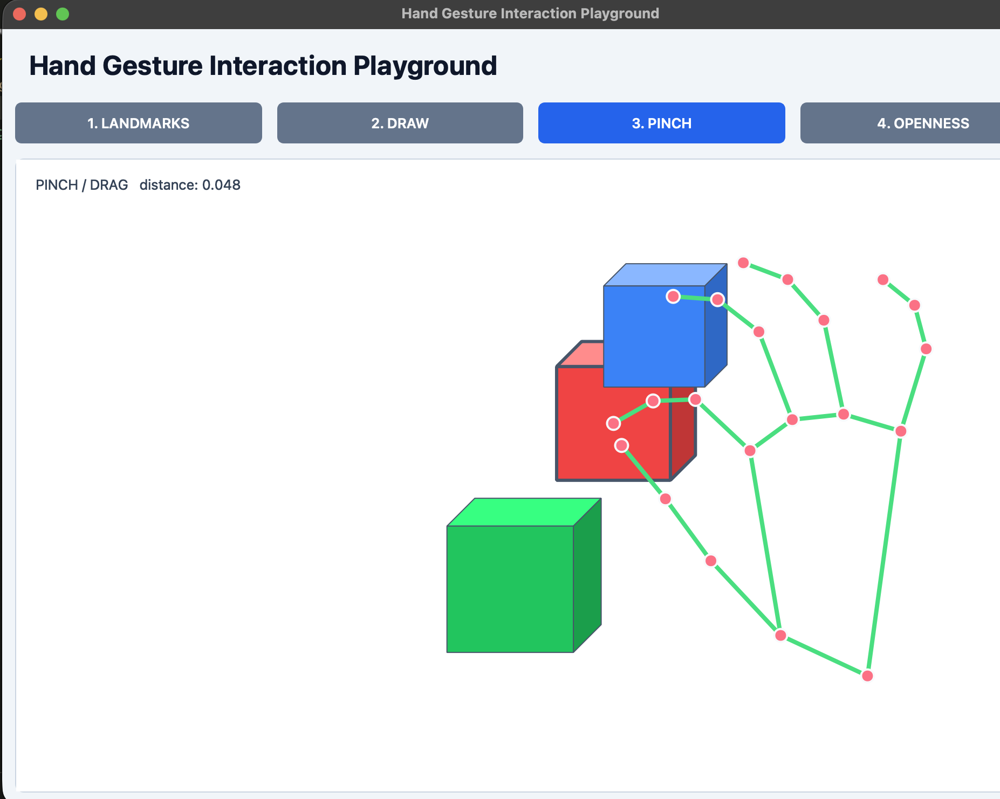
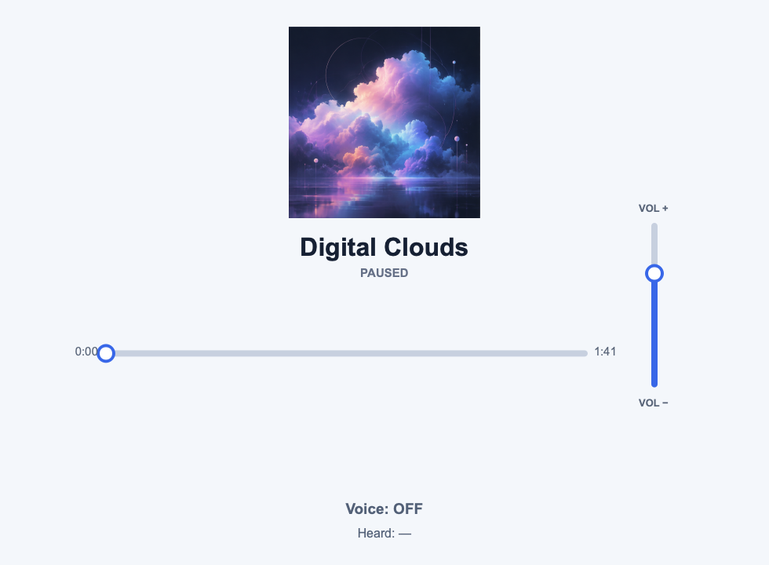

# ECE 209AS Interactive Systems Workshop

Starter code for exploring sensor-based, touchless interactions.

## Starter code

- **[Hand Interaction Playground](Demo1_HandInteractionPlayground/)** — Follow a
  hand-tracking pipeline from raw landmarks to drawing, pinching, dragging, and
  continuous openness control.
- **[Multimodal Inputs Playground](Demo2_MultimodalInputsPlayground/)** — Combine
  mid-air hand gestures with offline voice commands in a touchless music player.

These projects are examples, not limits. Remix them, replace the interactions,
or **invent your own** interactive system. See each folder's README for setup and
run instructions.
